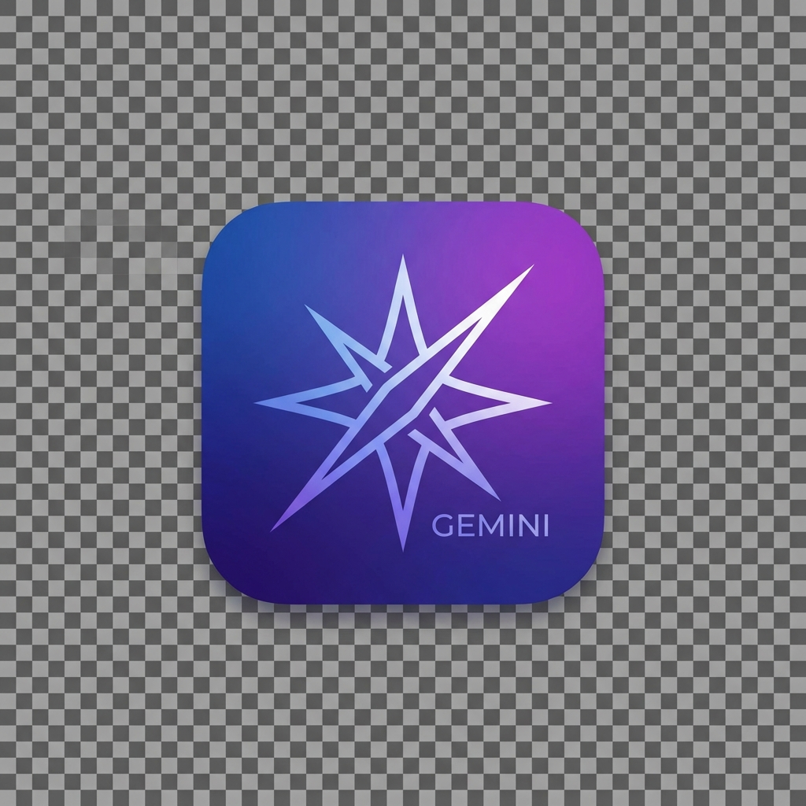

<p align="center">
  
</p>

<h1 align="center">Gemini Desktop</h1>

<p align="center">
  <em>Google Gemini as a native macOS app — no browser tab required.</em>
</p>

---

A lightweight Electron wrapper that gives [Google Gemini](https://gemini.google.com/) its own window, Dock icon, and keyboard shortcuts on macOS. Google sign-in works out of the box.

## Features

- Native macOS app with Dock icon and menu bar
- Google sign-in works (User Agent sanitization bypasses the "browser not secure" block)
- External links open in your default browser
- Standard Edit shortcuts (copy, paste, undo, redo, select all)
- Zoom controls (⌘+, ⌘-, ⌘0)
- Minimal footprint — just wraps the Gemini website

## Install from Release

Download the latest `.dmg` from [Releases](https://github.com/axiomfolly/gemini-desktop/releases), open it, and drag **Gemini** to **Applications**.

The app is ad-hoc signed with the entitlements required for macOS Tahoe+. If macOS shows a "damaged" warning after download, run:

```bash
xattr -cr /Applications/Gemini.app
```

## Build from Source

```bash
git clone https://github.com/axiomfolly/gemini-desktop.git
cd gemini-desktop
npm ci
./build.sh
```

Produces a signed `Gemini.app` in `Gemini-darwin-arm64/`.

### Architecture-specific builds

```bash
./build.sh arm64    # Apple Silicon (default)
./build.sh x64      # Intel
```

## Development

```bash
npm ci
npm start
```

## How Google Sign-In Works

Electron apps are normally blocked by Google's "This browser or app may not be secure" check. This wrapper solves it by:

1. Reading the real User Agent from the embedded Chromium engine
2. Stripping only the `Electron/...` and `Gemini/...` tokens — the Chrome version stays truthful
3. Disabling Blink automation flags (`AutomationControlled`)
4. Injecting navigator patches to hide `webdriver` and mock the `chrome` runtime object

No version spoofing, no lies — just surgical cleanup so Google sees a standard Chrome session.

## Requirements

- macOS 13.0 (Ventura) or later
- Apple Silicon or Intel Mac (universal build)

Tested on macOS 26.2 (Tahoe), Apple Silicon (M1).

## Project Structure

```
├── main.js            # Electron main process
├── preload.js         # Browser evasion scripts
├── icon.png           # App icon (PNG)
├── icon.icns          # App icon (macOS)
├── entitlements.plist # macOS code signing entitlements
├── build.sh           # Build + sign script
├── package.json
└── README.md
```

---

<p align="center">
  <b>Gemini Desktop</b> — by <a href="https://www.axiomfolly.net">axiomfolly.net</a>
  <br><br>
  <a href="https://ko-fi.com/axiomfolly">
    
  </a>
</p>
